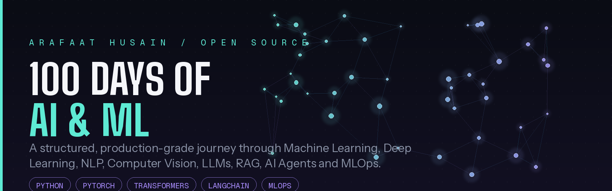
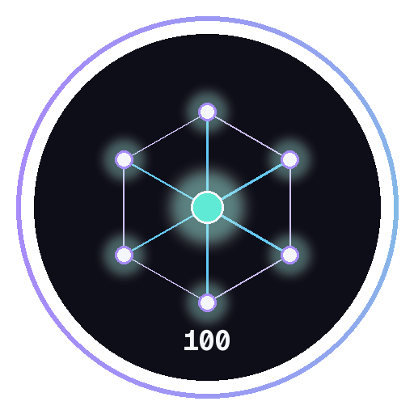

<div align="center">



<br/>



# 100 Days of AI & ML

### A Production-Grade, Fully Documented Journey from Zero to AI Engineer

**Master Machine Learning · Deep Learning · NLP · Computer Vision · LLMs · RAG · AI Agents · MLOps — One Day at a Time**

<br/>

[](https://www.python.org/)
[](LICENSE)
[](https://github.com/arafaathusain121/100-days-of-ai-ml/stargazers)
[](https://github.com/arafaathusain121/100-days-of-ai-ml/network/members)
[](https://github.com/arafaathusain121/100-days-of-ai-ml/issues)
[](https://github.com/arafaathusain121/100-days-of-ai-ml/pulls)
[](https://github.com/arafaathusain121/100-days-of-ai-ml/commits/main)
[](https://github.com/arafaathusain121/100-days-of-ai-ml)

[](https://visitorbadge.io)
[](https://github.com/arafaathusain121/100-days-of-ai-ml/actions)
[](https://opensource.org/)
[]()
[]()
[]()
[]()

<br/>

**[Explore the Roadmap](#-complete-ai-roadmap) · [View Progress](#-progress-tracking) · [Browse Projects](#-major-projects) · [Read the Docs](#-daily-folder-structure) · [Contribute](#-contributing-guide)**

</div>

<br/>

---

## Table of Contents

<details open>
<summary><strong>Click to expand / collapse</strong></summary>

- [About The Project](#-about-the-project)
- [Why This Repository Exists](#-why-this-repository-exists)
- [Repository Features](#-repository-features)
- [Learning Objectives](#-learning-objectives)
- [Complete AI Roadmap](#-complete-ai-roadmap)
- [Repository Folder Structure](#-repository-folder-structure)
- [Daily Folder Structure](#-daily-folder-structure)
- [Repository Architecture](#-repository-architecture)
- [Technology Stack](#-technology-stack)
- [Development Workflow](#-development-workflow)
- [Progress Tracking](#-progress-tracking)
- [Weekly Goals](#-weekly-goals)
- [Mini Projects Timeline](#-mini-projects-timeline)
- [Major Projects](#-major-projects)
- [Portfolio Projects](#-portfolio-projects)
- [AI Resources](#-ai-resources)
- [Recommended Learning Platforms](#-recommended-learning-platforms)
- [Repository Statistics](#-repository-statistics)
- [GitHub Activity](#-github-activity)
- [Installation Guide](#-installation-guide)
- [Clone Instructions](#-clone-instructions)
- [Running Notebooks](#-running-notebooks)
- [Python Environment Setup](#-python-environment-setup)
- [Requirements](#-requirements)
- [Repository Rules](#-repository-rules)
- [Code Style Guide](#-code-style-guide)
- [Git Commit Convention](#-git-commit-convention)
- [Git Branch Strategy](#-git-branch-strategy)
- [Contributing Guide](#-contributing-guide)
- [Open Source Guidelines](#-open-source-guidelines)
- [Issue Templates](#-issue-templates)
- [Pull Request Guidelines](#-pull-request-guidelines)
- [Security Policy](#-security-policy)
- [Code of Conduct](#-code-of-conduct)
- [FAQ](#-faq)
- [Future Roadmap](#-future-roadmap)
- [Acknowledgements](#-acknowledgements)
- [License](#-license)
- [Contact](#-contact)
- [Support This Project](#-support-this-project)

</details>

---

## About The Project

**100 Days of AI & ML** is a self-directed, publicly documented mastery program that takes a learner from foundational programming through advanced, production-ready artificial intelligence engineering in one hundred structured days.

Unlike scattered notebooks or private study notes, this repository is built and maintained with the same rigor as a production open-source library: versioned commits, reproducible environments, tested code, structured documentation, and a transparent history of progress. Every day of the challenge produces a self-contained unit of learning — theory, implementation, exercises, and reflection — that is reviewable, reusable, and readable by anyone who wants to follow the same path.

The repository does not aim to be a tutorial dump. It aims to be a **reference-quality curriculum** — the kind of resource a student can fork, a recruiter can audit, and a fellow engineer can learn from. It combines classical machine learning foundations with the modern AI stack: transformer architectures, large language models, retrieval-augmented generation, autonomous agents, and the Model Context Protocol, alongside the MLOps practices needed to ship AI systems responsibly.

<table>
<tr>
<td width="50%">

**What this repository is:**
- A structured, day-by-day curriculum
- A public accountability system
- A growing portfolio of real projects
- A well-documented knowledge base
- A demonstration of engineering discipline

</td>
<td width="50%">

**What this repository is not:**
- A copy-paste tutorial archive
- A collection of unfinished notebooks
- A one-time bootcamp export
- A private, undocumented scratchpad
- A static, abandoned repository

</td>
</tr>
</table>

---

## Why This Repository Exists

Learning artificial intelligence in isolation is easy to start and hard to sustain. Most learning repositories die somewhere around day ten — motivation fades, documentation is skipped, and the code becomes unreadable within weeks. This repository was built to solve that problem directly, using three principles borrowed from professional software engineering:

1. **Consistency over intensity.** A small, high-quality daily contribution compounds into deep expertise far more reliably than sporadic bursts of effort.
2. **Documentation is not optional.** Every concept learned is written down, explained, and linked to working code, because the ability to explain a concept clearly is the truest test of understanding it.
3. **Build in public.** Publishing the journey — including the mistakes — creates accountability, invites feedback, and produces a portfolio that speaks for itself by the time the 100 days are complete.

The long-term goal is for this repository to serve two audiences at once: the future version of the author who needs to revisit a concept, and any other learner who wants a proven, structured path into professional AI engineering.

---

## Repository Features

<table>
<tr>
<th width="30%">Feature</th>
<th>Description</th>
</tr>
<tr>
<td><strong>Structured 100-Day Curriculum</strong></td>
<td>A carefully sequenced path from Python fundamentals to production LLM systems, grouped into 15 themed weeks.</td>
</tr>
<tr>
<td><strong>Daily Documentation</strong></td>
<td>Every day ships with a dedicated README covering theory, implementation notes, and personal reflection.</td>
</tr>
<tr>
<td><strong>Reproducible Notebooks</strong></td>
<td>All notebooks run top-to-bottom with pinned dependencies and clearly documented environments.</td>
</tr>
<tr>
<td><strong>Mini Projects Every Week</strong></td>
<td>Applied exercises that reinforce each week's theory with small, shippable builds.</td>
</tr>
<tr>
<td><strong>Capstone-Grade Major Projects</strong></td>
<td>Full-scale projects covering computer vision, NLP, RAG pipelines, and autonomous agents.</td>
</tr>
<tr>
<td><strong>Quizzes & Self-Assessment</strong></td>
<td>End-of-day quizzes to validate retention before moving forward.</td>
</tr>
<tr>
<td><strong>Clean Commit History</strong></td>
<td>Conventional Commits and a disciplined branching strategy keep the history readable and useful.</td>
</tr>
<tr>
<td><strong>MLOps-First Mindset</strong></td>
<td>Deployment, containerization, and cloud practices are treated as first-class citizens, not an afterthought.</td>
</tr>
<tr>
<td><strong>Open Source Ready</strong></td>
<td>Issue templates, contribution guides, a code of conduct, and a security policy from day one.</td>
</tr>
<tr>
<td><strong>Portfolio Oriented</strong></td>
<td>Every major project is written to stand alone as a portfolio piece for recruiters and collaborators.</td>
</tr>
</table>

---

## Learning Objectives

By the end of the 100 days, this repository is designed to demonstrate mastery of the following:

- Strong programming fundamentals in Python, Git, and Linux command-line workflows.
- Applied mathematics and statistics as they relate to machine learning: linear algebra, calculus, probability.
- Classical machine learning: regression, classification, clustering, ensemble methods, and model evaluation.
- Deep learning fundamentals and frameworks: neural networks, PyTorch, and TensorFlow.
- Computer vision: convolutional networks, OpenCV, and image-based applications.
- Natural language processing: tokenization, embeddings, and sequence models through to transformers.
- Large language models: architecture, prompt engineering, fine-tuning, and evaluation.
- Retrieval-augmented generation, vector databases, and semantic search pipelines.
- Agentic AI systems built with LangChain, LangGraph, and the Model Context Protocol.
- MLOps and deployment: FastAPI services, Docker containers, Kubernetes orchestration, and cloud deployment on AWS, Azure, and GCP.
- Professional open-source practices: documentation, testing, contribution workflows, and community standards.

---

## Complete AI Roadmap

<details open>
<summary><strong>Phase 1 — Foundations</strong></summary>

| Track | Topics Covered |
|---|---|
| Python | Syntax, data structures, OOP, file I/O, error handling, virtual environments |
| Git & GitHub | Version control, branching, pull requests, collaboration workflows |
| Linux & CLI | Shell navigation, permissions, process management, scripting |
| NumPy | Arrays, broadcasting, vectorization, linear algebra operations |
| Pandas | DataFrames, cleaning, transformation, aggregation, merging |
| Statistics | Descriptive statistics, probability distributions, hypothesis testing |
| Mathematics | Linear algebra, calculus for ML, optimization fundamentals |

</details>

<details open>
<summary><strong>Phase 2 — Machine Learning</strong></summary>

| Track | Topics Covered |
|---|---|
| Supervised Learning | Regression, classification, decision trees, ensemble methods |
| Unsupervised Learning | Clustering, dimensionality reduction, anomaly detection |
| Model Evaluation | Cross-validation, metrics, bias-variance tradeoff, hyperparameter tuning |
| Feature Engineering | Encoding, scaling, selection, pipeline construction |

</details>

<details open>
<summary><strong>Phase 3 — Deep Learning</strong></summary>

| Track | Topics Covered |
|---|---|
| Neural Networks | Perceptrons, backpropagation, activation functions, optimizers |
| PyTorch | Tensors, autograd, custom models, training loops |
| TensorFlow | Keras API, model building, callbacks, TensorBoard |
| Regularization | Dropout, batch normalization, early stopping |

</details>

<details open>
<summary><strong>Phase 4 — Computer Vision</strong></summary>

| Track | Topics Covered |
|---|---|
| CNNs | Convolutions, pooling, architectures (ResNet, VGG, EfficientNet) |
| OpenCV | Image processing, feature detection, video analysis |
| Applications | Object detection, image segmentation, transfer learning |

</details>

<details open>
<summary><strong>Phase 5 — NLP & Language Models</strong></summary>

| Track | Topics Covered |
|---|---|
| Classical NLP | Tokenization, embeddings, TF-IDF, sequence models |
| Transformers | Attention mechanisms, encoder-decoder architectures |
| LLMs | GPT-family models, open-weight models, evaluation |
| Prompt Engineering | Prompt design, chaining, few-shot and zero-shot techniques |

</details>

<details open>
<summary><strong>Phase 6 — Retrieval & Agents</strong></summary>

| Track | Topics Covered |
|---|---|
| RAG | Retrieval-augmented generation pipelines, chunking strategies |
| Vector Databases | Embedding storage, similarity search, indexing |
| LangChain / LangGraph | Chains, graphs, memory, tool integration |
| AI Agents | Autonomous planning, tool use, multi-agent systems |
| MCP | Model Context Protocol servers and client integration |
| Fine Tuning | Parameter-efficient fine-tuning, dataset preparation |

</details>

<details open>
<summary><strong>Phase 7 — MLOps & Deployment</strong></summary>

| Track | Topics Covered |
|---|---|
| FastAPI | Building and documenting production APIs |
| Docker | Containerization, multi-stage builds, image optimization |
| Kubernetes | Orchestration, scaling, service management |
| Cloud | Deployment on AWS, Azure, and GCP |
| Capstones | End-to-end, production-grade AI systems |
| Open Source | Publishing, maintaining, and growing a public project |

</details>

---

## Repository Folder Structure

```text
100-days-of-ai-ml/
├── .github/
│   ├── ISSUE_TEMPLATE/
│   │   ├── bug_report.md
│   │   ├── feature_request.md
│   │   └── question.md
│   ├── workflows/
│   │   └── ci.yml
│   ├── PULL_REQUEST_TEMPLATE.md
│   └── CODEOWNERS
├── assets/
│   ├── banner.png
│   ├── logo.png
│   └── screenshots/
├── days/
│   ├── day-001-python-basics/
│   ├── day-002-python-data-structures/
│   ├── ...
│   └── day-100-capstone-showcase/
├── projects/
│   ├── mini-projects/
│   ├── major-projects/
│   └── portfolio-projects/
├── notebooks/
│   └── shared/
├── resources/
│   ├── books.md
│   ├── courses.md
│   ├── papers.md
│   └── roadmaps.md
├── scripts/
│   ├── setup_env.sh
│   └── generate_progress_table.py
├── docs/
│   ├── architecture.md
│   └── glossary.md
├── tests/
├── requirements.txt
├── environment.yml
├── CONTRIBUTING.md
├── CODE_OF_CONDUCT.md
├── SECURITY.md
├── LICENSE
└── README.md
```

---

## Daily Folder Structure

Every single day directory under `days/` follows an identical, predictable structure so that content is always easy to navigate:

```text
days/day-XXX-topic-name/
├── README.md          # Daily overview, objectives, and summary
├── theory.md           # Concept notes and explanations
├── code/                # Standalone scripts implementing the day's concepts
├── notebook.ipynb      # Interactive, reproducible notebook
├── quiz.md              # Self-assessment questions and answers
├── reflection.md        # Personal notes on challenges and takeaways
├── resources.md         # Curated links, articles, and references used
├── images/               # Diagrams and visual assets for the day
├── outputs/              # Generated artifacts, plots, and model outputs
├── exercises/            # Practice problems with solutions
├── assignments/          # Extended assignments building on the day's topic
└── mini-project/         # A small applied project tying the day together
```

---

## Repository Architecture

```text
┌──────────────────────────────────────────────────────────────────────┐
│                         100 DAYS OF AI & ML                          │
├──────────────────────────────────────────────────────────────────────┤
│                                                                        │
│   ┌───────────────┐     ┌───────────────┐     ┌───────────────┐     │
│   │  FOUNDATIONS  │ --> │  MACHINE      │ --> │  DEEP          │     │
│   │  Python · Git │     │  LEARNING     │     │  LEARNING       │     │
│   │  Math · Stats │     │  Sklearn      │     │  PyTorch/TF     │     │
│   └───────────────┘     └───────────────┘     └───────┬─────────┘     │
│                                                        │               │
│           ┌────────────────────────────────────────────┘             │
│           ▼                                                          │
│   ┌───────────────┐     ┌───────────────┐     ┌───────────────┐     │
│   │  COMPUTER      │ --> │  NLP & LLMs   │ --> │  RAG & AGENTS │     │
│   │  VISION        │     │  Transformers │     │  LangChain     │     │
│   │  OpenCV/CNNs   │     │  Prompting    │     │  MCP · Vectors │     │
│   └───────────────┘     └───────────────┘     └───────┬─────────┘     │
│                                                        │               │
│                                                        ▼               │
│                                          ┌───────────────────────┐    │
│                                          │        MLOps          │    │
│                                          │  FastAPI · Docker      │    │
│                                          │  Kubernetes · Cloud   │    │
│                                          └───────────┬───────────┘    │
│                                                       ▼                │
│                                          ┌───────────────────────┐    │
│                                          │   CAPSTONE PROJECTS   │    │
│                                          │  Production AI Systems│    │
│                                          └───────────────────────┘    │
│                                                                        │
└──────────────────────────────────────────────────────────────────────┘
```

---

## Technology Stack

<table>
<tr>
<th>Category</th>
<th>Technologies</th>
</tr>
<tr>
<td><strong>Languages</strong></td>
<td>Python, Bash, SQL</td>
</tr>
<tr>
<td><strong>Core Libraries</strong></td>
<td>NumPy, Pandas, Matplotlib, Seaborn, Scikit-learn</td>
</tr>
<tr>
<td><strong>Deep Learning</strong></td>
<td>PyTorch, TensorFlow, Keras</td>
</tr>
<tr>
<td><strong>Computer Vision</strong></td>
<td>OpenCV, Pillow, torchvision</td>
</tr>
<tr>
<td><strong>NLP & LLMs</strong></td>
<td>Hugging Face Transformers, spaCy, NLTK, tokenizers</td>
</tr>
<tr>
<td><strong>Agentic AI</strong></td>
<td>LangChain, LangGraph, Model Context Protocol (MCP)</td>
</tr>
<tr>
<td><strong>Vector Databases</strong></td>
<td>FAISS, ChromaDB, Pinecone</td>
</tr>
<tr>
<td><strong>APIs & Backend</strong></td>
<td>FastAPI, Pydantic, Uvicorn</td>
</tr>
<tr>
<td><strong>DevOps & Cloud</strong></td>
<td>Docker, Kubernetes, AWS, Azure, GCP, GitHub Actions</td>
</tr>
<tr>
<td><strong>Tooling</strong></td>
<td>Jupyter, VS Code, Git, Poetry / pip, Black, Ruff</td>
</tr>
</table>

---

## Development Workflow

```text
  LEARN  →  PRACTICE  →  BUILD  →  DOCUMENT  →  COMMIT  →  PUSH  →  REFLECT  →  REPEAT
    │           │           │          │            │         │          │
    ▼           ▼           ▼          ▼            ▼         ▼          ▼
 Read /     Solve day's  Ship a    Write the     Conventional  Sync to   Log
 watch      exercises    mini      day's README  Commit        GitHub    takeaways
 theory                  project                 message                 in reflection.md
```

Each day follows this loop without exception. Skipping documentation or reflection is treated as an incomplete day, even if the code works.

---

## Progress Tracking

**Overall Progress: 0 / 100 Days Complete**

`░░░░░░░░░░░░░░░░░░░░░░░░░░░░░░░░░░░░░░░░` 0%

<details>
<summary><strong>View Full 100-Day Progress Table</strong></summary>

| Day | Topic | Status |
|:---:|---|:---:|
| 001 | Python Basics | ⬜ Not Started |
| 002 | Python Data Structures | ⬜ Not Started |
| 003 | Object-Oriented Python | ⬜ Not Started |
| 004 | Git & GitHub Fundamentals | ⬜ Not Started |
| 005 | Linux & Command Line | ⬜ Not Started |
| 006 | NumPy Fundamentals | ⬜ Not Started |
| 007 | Pandas Fundamentals | ⬜ Not Started |
| 008 | Data Visualization | ⬜ Not Started |
| 009 | Statistics for ML | ⬜ Not Started |
| 010 | Mini Project — Data Analysis | ⬜ Not Started |
| ... | ... | ⬜ Not Started |
| 100 | Capstone Showcase | ⬜ Not Started |

*This table is generated and updated via `scripts/generate_progress_table.py` as each day is completed. Legend: ⬜ Not Started · 🟨 In Progress · ✅ Complete.*

</details>

---

## Weekly Goals

<table>
<tr><th>Week</th><th>Focus</th><th>Outcome</th></tr>
<tr><td>Week 1</td><td>Python & Programming Foundations</td><td>Comfortable writing clean, idiomatic Python</td></tr>
<tr><td>Week 2</td><td>Git, GitHub, and Linux</td><td>Confident with version control and CLI workflows</td></tr>
<tr><td>Week 3</td><td>NumPy & Pandas</td><td>Able to manipulate and analyze real datasets</td></tr>
<tr><td>Week 4</td><td>Statistics & Mathematics for ML</td><td>Solid intuition for the math behind ML algorithms</td></tr>
<tr><td>Week 5</td><td>Core Machine Learning</td><td>Able to train and evaluate classical ML models</td></tr>
<tr><td>Week 6</td><td>Advanced Machine Learning</td><td>Comfortable with ensembles and model tuning</td></tr>
<tr><td>Week 7</td><td>Neural Network Foundations</td><td>Understanding of backpropagation and training dynamics</td></tr>
<tr><td>Week 8</td><td>PyTorch & TensorFlow</td><td>Able to build and train deep learning models</td></tr>
<tr><td>Week 9</td><td>Computer Vision</td><td>Able to build CNN-based vision applications</td></tr>
<tr><td>Week 10</td><td>NLP Foundations</td><td>Understanding of embeddings and sequence models</td></tr>
<tr><td>Week 11</td><td>Transformers & LLMs</td><td>Able to work with and fine-tune modern LLMs</td></tr>
<tr><td>Week 12</td><td>RAG & Vector Databases</td><td>Able to build retrieval-augmented pipelines</td></tr>
<tr><td>Week 13</td><td>AI Agents & MCP</td><td>Able to design autonomous, tool-using agents</td></tr>
<tr><td>Week 14</td><td>MLOps & Deployment</td><td>Able to containerize and deploy AI services</td></tr>
<tr><td>Week 15</td><td>Capstone & Portfolio</td><td>A polished, production-grade capstone project</td></tr>
</table>

---

## Mini Projects Timeline

| Week | Mini Project |
|:---:|---|
| 1 | Command-line data utility built in pure Python |
| 3 | Exploratory data analysis on a public dataset |
| 5 | House price prediction with regression models |
| 6 | Customer churn classifier with ensemble methods |
| 8 | Handwritten digit classifier with a custom neural network |
| 9 | Real-time object detection demo with OpenCV |
| 10 | Sentiment analysis on product reviews |
| 11 | Prompt-engineered chatbot using an open LLM |
| 12 | Document Q&A system using RAG |
| 13 | Multi-tool AI agent with LangGraph |
| 14 | Dockerized FastAPI inference service |

---

## Major Projects

<table>
<tr><th>Project</th><th>Domain</th><th>Highlights</th></tr>
<tr>
<td><strong>Vision Insight Engine</strong></td>
<td>Computer Vision</td>
<td>End-to-end image classification and detection pipeline with a served inference API</td>
</tr>
<tr>
<td><strong>Conversational Knowledge Base</strong></td>
<td>RAG</td>
<td>Full retrieval-augmented generation system over a private document corpus with a vector database backend</td>
</tr>
<tr>
<td><strong>Autonomous Research Agent</strong></td>
<td>AI Agents</td>
<td>Multi-step, tool-using agent built with LangGraph and MCP for autonomous web research and summarization</td>
</tr>
<tr>
<td><strong>Production ML API</strong></td>
<td>MLOps</td>
<td>FastAPI service with Dockerized deployment, CI/CD, and cloud hosting</td>
</tr>
</table>

---

## Portfolio Projects

These are the polished, standalone deliverables intended to be shown directly to recruiters and collaborators. Each one lives in `projects/portfolio-projects/` with its own documentation, demo instructions, and, where applicable, a hosted live demo link.

- **Capstone AI Platform** — a unified system combining computer vision, NLP, and agentic reasoning behind a single deployed API.
- **Open Source Contribution Log** — a documented record of external contributions made during the 100 days.
- **Technical Writing Portfolio** — the full collection of daily theory notes, cleaned up and cross-linked as a standalone knowledge base.

---

## AI Resources

<details>
<summary><strong>Books</strong></summary>

- *Hands-On Machine Learning with Scikit-Learn, Keras, and TensorFlow* — Aurélien Géron
- *Deep Learning* — Ian Goodfellow, Yoshua Bengio, Aaron Courville
- *Speech and Language Processing* — Daniel Jurafsky, James H. Martin
- *The Elements of Statistical Learning* — Hastie, Tibshirani, Friedman

</details>

<details>
<summary><strong>Courses</strong></summary>

- Andrew Ng's Machine Learning Specialization (DeepLearning.AI)
- CS231n: Convolutional Neural Networks for Visual Recognition (Stanford)
- CS224n: Natural Language Processing with Deep Learning (Stanford)
- Fast.ai Practical Deep Learning for Coders

</details>

<details>
<summary><strong>Documentation</strong></summary>

- [PyTorch Documentation](https://pytorch.org/docs/stable/index.html)
- [TensorFlow Documentation](https://www.tensorflow.org/guide)
- [Hugging Face Documentation](https://huggingface.co/docs)
- [LangChain Documentation](https://python.langchain.com/)

</details>

<details>
<summary><strong>Research Papers</strong></summary>

- *Attention Is All You Need* — Vaswani et al., 2017
- *BERT: Pre-training of Deep Bidirectional Transformers* — Devlin et al., 2018
- *Language Models are Few-Shot Learners* (GPT-3) — Brown et al., 2020
- *Retrieval-Augmented Generation for Knowledge-Intensive NLP Tasks* — Lewis et al., 2020

</details>

<details>
<summary><strong>Communities</strong></summary>

- Hugging Face Forums and Discord
- r/MachineLearning
- Kaggle Discussions
- Local and virtual AI meetups

</details>

<details>
<summary><strong>Roadmaps</strong></summary>

- [roadmap.sh AI and Data Scientist Roadmap](https://roadmap.sh/ai-data-scientist)
- [Papers with Code](https://paperswithcode.com/)

</details>

---

## Recommended Learning Platforms

| Platform | Best For |
|---|---|
| Coursera | Structured, university-backed courses |
| Kaggle | Datasets, competitions, and applied practice |
| Hugging Face | Model hub, datasets, and NLP tooling |
| YouTube (curated channels) | Free, high-quality explainer content |
| ArXiv | Original research papers |
| GitHub | Open-source reference implementations |

---

## Repository Statistics

<div align="center">


</div>

---

## GitHub Activity

<div align="center">


<!-- Snake animation: generate via the snk GitHub Action and reference the output SVG -->


<!-- GitHub Trophies -->


</div>

---

## Installation Guide

The instructions below set up the repository for local development, notebook execution, and running the mini and major projects.

### Prerequisites

- Python 3.11 or newer
- Git
- (Optional) Docker, for containerized projects
- (Optional) A CUDA-capable GPU, for accelerated deep learning workloads

---

## Clone Instructions

```bash
git clone https://github.com/arafaathusain121/100-days-of-ai-ml.git
cd 100-days-of-ai-ml
```

---

## Running Notebooks

```bash
# Activate your environment first (see Python Environment Setup below)
pip install jupyterlab
jupyter lab
```

Navigate to the relevant `days/day-XXX-topic-name/notebook.ipynb` file and run all cells from top to bottom.

---

## Python Environment Setup

<details>
<summary><strong>Using venv (recommended)</strong></summary>

```bash
python -m venv .venv
source .venv/bin/activate      # On Windows: .venv\Scripts\activate
pip install --upgrade pip
pip install -r requirements.txt
```

</details>

<details>
<summary><strong>Using Conda</strong></summary>

```bash
conda env create -f environment.yml
conda activate ai-ml-100days
```

</details>

---

## Requirements

Core dependencies are pinned in `requirements.txt`. A representative excerpt:

```text
numpy>=1.26
pandas>=2.2
scikit-learn>=1.4
matplotlib>=3.8
torch>=2.2
tensorflow>=2.16
transformers>=4.40
langchain>=0.2
fastapi>=0.111
uvicorn>=0.29
```

Individual days and projects may include an additional, scoped `requirements.txt` where a specific dependency set is required.

---

## Repository Rules

- Every day must include a completed `README.md` before it is considered finished.
- No day is merged into `main` without a working, reproducible notebook or script.
- All code must be formatted and linted before committing.
- Large datasets and model weights are never committed directly; they are referenced via download scripts or `.gitignore`d and documented instead.
- Every mini and major project must include instructions to reproduce results from a clean environment.

---

## Code Style Guide

- Follow [PEP 8](https://peps.python.org/pep-0008/) for all Python code.
- Use type hints for function signatures wherever practical.
- Format code with `black` and lint with `ruff` before committing.
- Prefer descriptive variable and function names over abbreviations.
- Keep functions small and single-purpose; extract reusable logic into `scripts/` or shared modules.
- Document non-obvious logic with concise comments rather than restating the code.

```bash
black .
ruff check .
```

---

## Git Commit Convention

This repository follows the [Conventional Commits](https://www.conventionalcommits.org/) specification.

```text
<type>(<scope>): <short summary>

[optional body]

[optional footer]
```

| Type | Purpose |
|---|---|
| `feat` | A new feature, day, or project |
| `fix` | A bug fix |
| `docs` | Documentation-only changes |
| `refactor` | Code change that neither fixes a bug nor adds a feature |
| `test` | Adding or updating tests |
| `chore` | Maintenance tasks, dependency updates, tooling |

**Example:**

```text
feat(day-042): implement transformer attention from scratch
docs(day-042): add theory notes and reflection
```

---

## Git Branch Strategy

| Branch | Purpose |
|---|---|
| `main` | Always stable; represents completed, documented days |
| `dev` | Integration branch for work in progress |
| `day/XXX-topic` | Feature branch for an individual day's work |
| `project/name` | Feature branch for a mini or major project |

All work is merged into `dev` via pull request, then periodically promoted to `main` once verified.

---

## Contributing Guide

Contributions, corrections, and suggestions are welcome, even though this is primarily a personal learning journey.

1. Fork the repository.
2. Create a feature branch following the [branch strategy](#-git-branch-strategy).
3. Make your changes, following the [code style guide](#-code-style-guide).
4. Commit using the [commit convention](#-git-commit-convention).
5. Open a pull request describing the change and its motivation.

See `CONTRIBUTING.md` for the full guide.

---

## Open Source Guidelines

- All contributions are reviewed before merging; expect constructive feedback.
- Keep pull requests focused and scoped to a single change.
- Discuss significant changes in an issue before opening a pull request.
- Respect the [Code of Conduct](#-code-of-conduct) in all interactions.

---

## Issue Templates

This repository ships with structured templates under `.github/ISSUE_TEMPLATE/`:

- **Bug Report** — for errors in code, notebooks, or documentation.
- **Feature Request** — for suggesting new days, projects, or improvements.
- **Question** — for general questions about the curriculum or implementation.

---

## Pull Request Guidelines

- Reference the related issue, if one exists.
- Include a clear description of what changed and why.
- Ensure all notebooks run cleanly from top to bottom before submitting.
- Ensure formatting and linting checks pass.
- Keep the diff focused; unrelated changes belong in a separate pull request.

---

## Security Policy

If a security vulnerability is discovered in any code, dependency, or workflow within this repository, please report it privately rather than opening a public issue. See `SECURITY.md` for reporting instructions and expected response times.

---

## Code of Conduct

This project follows the [Contributor Covenant](https://www.contributor-covenant.org/) Code of Conduct. Participants are expected to engage respectfully and constructively. See `CODE_OF_CONDUCT.md` for the full text.

---

## FAQ

<details>
<summary><strong>Is this repository suitable for complete beginners?</strong></summary>
<br/>
Yes. The first two weeks are dedicated entirely to programming, tooling, and mathematical foundations before any machine learning content is introduced.
</details>

<details>
<summary><strong>Can I fork this repository and follow the same 100-day plan?</strong></summary>
<br/>
Yes. The repository is structured specifically so it can be forked and adapted. Attribution is appreciated but not required.
</details>

<details>
<summary><strong>Do I need a GPU to follow along?</strong></summary>
<br/>
No. Early and mid-stage content runs comfortably on CPU. GPU access becomes useful, though not mandatory, from the deep learning and LLM fine-tuning sections onward.
</details>

<details>
<summary><strong>How is progress tracked?</strong></summary>
<br/>
Through the progress table in this README, daily commit history, and the reflection notes included in each day's folder.
</details>

<details>
<summary><strong>Will this repository continue after Day 100?</strong></summary>
<br/>
Yes. See the <a href="#-future-roadmap">Future Roadmap</a> section for planned post-completion goals.
</details>

---

## Future Roadmap

- [ ] Complete all 100 days with full documentation.
- [ ] Publish a companion blog series expanding on selected daily topics.
- [ ] Package select utilities developed during the challenge as standalone open-source libraries.
- [ ] Record short video walkthroughs for each major project.
- [ ] Extend the curriculum with a "Advanced 30 Days" track covering research-level topics.
- [ ] Open the repository to community-contributed days and projects.

---

## Acknowledgements

- The open-source maintainers of PyTorch, TensorFlow, Hugging Face, LangChain, and scikit-learn, whose tools make this curriculum possible.
- The authors and instructors behind the books, courses, and papers listed in the [AI Resources](#-ai-resources) section.
- The broader AI and open-source community for continuous inspiration and knowledge sharing.

---

## License

This project is licensed under the **MIT License**. See the [LICENSE](LICENSE) file for full details.

---

## Contact

<div align="center">

[](https://github.com/arafaathusain121)
[](https://arafaathusain.vercel.app)
[](mailto:arafaathusain9@gmail.com)

</div>

---

## Support This Project

If this repository has been useful to you, consider supporting it:

- **Star** the repository to help others discover it.
- **Fork** it to start your own version of the challenge.
- **Share** it with anyone learning AI and machine learning.

<div align="center">

[](https://github.com/arafaathusain121/100-days-of-ai-ml/stargazers)
[](https://github.com/arafaathusain121/100-days-of-ai-ml/fork)

</div>

---

<div align="center">

**Made with discipline, curiosity, and a genuine passion for Artificial Intelligence and Open Source.**

*100 Days of AI & ML — Day by day, from fundamentals to production.*

</div>
